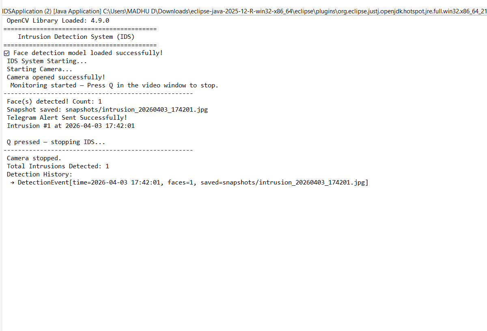
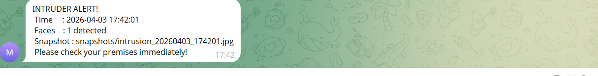

# 📷 Real-Time Face Detection & Alert System — Java + OpenCV + Telegram

## 📌 About The Project

A real-time face detection application built in **Java** using **OpenCV** (Haar Cascade classifier) and the **Telegram Bot API** for instant mobile alerts.

When a face is detected in the webcam feed:

1. 🟢 A **green rectangle** is drawn around the detected face
2. 📸 A **snapshot is saved** automatically
3. 📱 A **Telegram alert** is sent to your phone

> 💡 Originally built in Python using Flask + Twilio. Rebuilt in Java with OpenCV + Telegram for a deeper understanding of Java, multithreading and API integration.

> ⚠️ This project detects faces; it does not recognise who they are. It cannot tell a known person from a stranger (see Future Improvements).

---

## ✨ Features

| Feature | Description |
|---------|-------------|
| ✅ Live Webcam Feed | Real-time video window with face detection overlay |
| ✅ Face Detection | Haar Cascade Classifier (frontal face) |
| ✅ Rectangle Drawing | Green box drawn around every detected face |
| ✅ Snapshot Saving | Auto-saves images to the `/snapshots/` folder |
| ✅ Telegram Alert | Instant mobile notification with time and face count |
| ✅ Alert Cooldown | Prevents spam: one alert every 10 seconds |
| ✅ Detection History | Logs all detection events in memory |
| ✅ Clean Exit | Press Q to stop the system gracefully |
| ✅ Thread-based | Camera runs on a separate thread using Java Thread |

---

## 🗂️ Project Structure

```
IDS-Project/
├── src/
│   ├── main/
│   │   └── IDSApplication.java       → Entry point
│   ├── controller/
│   │   └── IDSController.java        → System controller
│   ├── monitor/
│   │   └── CameraMonitor.java        → Webcam thread + display
│   ├── service/
│   │   ├── DetectionService.java     → Face detection + alert trigger
│   │   └── NotificationService.java  → Telegram bot notification
│   ├── model/
│   │   └── DetectionEvent.java       → Detection event data model
│   ├── config/
│   │   └── AppConfig.java            → Bot token + settings
│   ├── util/
│   │   └── DateTimeUtil.java         → Timestamp formatting
│   ├── exception/
│   │   └── DetectionException.java   → Custom exception
│   └── haarcascade_frontalface_default.xml
├── snapshots/                         → Auto-created, stores captured images
└── README.md
```

---

## 🛠️ Tech Stack

- **Language:** Java (Core Java, Java 8+, Multithreading)
- **Computer Vision:** OpenCV 4.x (Java bindings)
- **Notification:** Telegram Bot API
- **Algorithm:** Haar Cascade Classifier
- **IDE:** Eclipse

---

## ⚙️ Setup & Installation

### Prerequisites

- Java JDK 8 or above
- OpenCV 4.x JAR + native library (`.dll` on Windows)
- Eclipse IDE
- A Telegram account

### Step 1 — Clone the Repository

```
git clone https://github.com/Madhumitha-divate/ids-java-opencv.git
```

### Step 2 — Add OpenCV to Eclipse

1. Right-click project → **Build Path** → **Configure Build Path**
2. **Libraries** → **Add External JARs** → select `opencv-4xx.jar`
3. Expand the JAR → **Native library location** → add the folder containing `opencv_java4xx.dll`

### Step 3 — Download the Haar Cascade XML

Download `haarcascade_frontalface_default.xml` from:

```
https://github.com/opencv/opencv/tree/master/data/haarcascades
```

Place it in the `/src/` folder of your project.

### Step 4 — Create a Telegram Bot

1. Open Telegram and search for **@BotFather**
2. Send `/newbot` and follow the instructions to get your **Bot Token**
3. Send any message to your new bot
4. Open this URL in a browser:
   ```
   https://api.telegram.org/bot<YOUR_BOT_TOKEN>/getUpdates
   ```
5. Find `"chat" → "id"`: that is your **Chat ID**

### Step 5 — Configure AppConfig.java

```java
public static final String BOT_TOKEN = "your_bot_token_here";
public static final String CHAT_ID   = "your_chat_id_here";
```

> 🔐 Never commit your real bot token. Keep placeholders in the repository and use your real values only on your own machine.

### Step 6 — Run

Right-click `IDSApplication.java` → **Run As** → **Java Application**

---

## 📱 Sample Telegram Alert

```
🚨 INTRUDER ALERT!
📅 Time     : 2026-03-31 14:32:05
👤 Faces    : 1 detected
📸 Snapshot : snapshots/intrusion_20260331_143205.jpg
🔴 Please check your premises immediately!
```

## 📸 Demo

### 🖥️ Live System Output



### 📱 Telegram Alert Received



---

## 🔄 How It Works

```
Webcam Frame
     ↓
Convert to Grayscale
     ↓
Haar Cascade detectMultiScale()
     ↓
Face Found?
  YES → Draw Rectangle → Save Snapshot → Send Telegram Alert
  NO  → Show "Monitoring..." status
     ↓
Display Live Window
     ↓
Press Q → Stop Cleanly
```

---

## 🔑 Key Concepts Demonstrated

- **OpenCV Java integration:** VideoCapture, CascadeClassifier, HighGui
- **Multithreading:** CameraMonitor extends Thread
- **Haar Cascade algorithm:** real-time face detection
- **Telegram Bot API:** HTTP request for notifications
- **Custom exception handling:** DetectionException
- **Layered architecture:** controller, service, model and monitor separation
- **Cooldown mechanism:** prevents notification spam

---

## 🚀 Future Improvements

- [ ] Face recognition (identify known vs unknown faces)
- [ ] Email alert with snapshot attachment
- [ ] Web dashboard to view detection history
- [ ] Multiple camera support
- [ ] Save detection logs to MySQL
- [ ] Spring Boot REST API version

---

## 👩‍💻 Author

**Madhumitha Divate**

- 🔗 [LinkedIn](https://www.linkedin.com/in/madhumitha-divate/)
- 💻 [GitHub](https://github.com/Madhumitha-divate)
